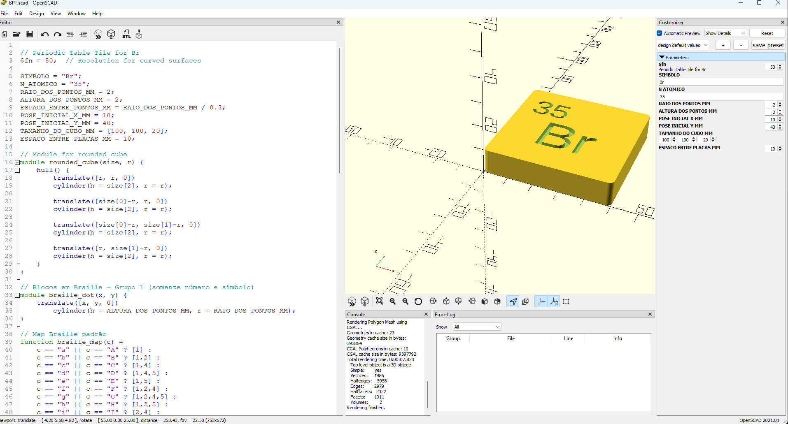
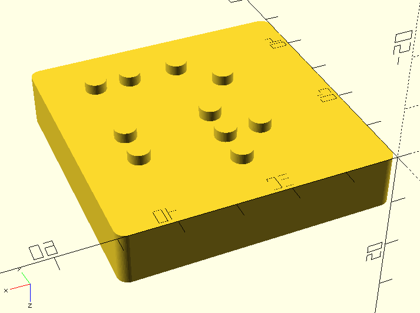

# Braille Periodic Table Tile Generator

This OpenSCAD project allows you to generate 3D printable tiles for the periodic table, featuring both the chemical symbol and atomic number, along with their Braille representations. This is designed to make the periodic table accessible to visually impaired individuals.

## Features

*   **Customizable Element Tiles**: Easily change the element symbol and atomic number.
*   **Braille Integration**: Automatically generates Braille dots for the atomic number and chemical symbol.
*   **3D Printable**: The generated models are ready for 3D printing.
*   **Adjustable Parameters**: Control various dimensions like dot size, spacing, and overall tile size.

## Getting Started

### Prerequisites

To use this OpenSCAD file, you need to have OpenSCAD installed on your system.

*   [Download OpenSCAD](http://www.openscad.org/downloads.html)

### Usage

1.  **Open the File**: Open the `BPT.scad` file in OpenSCAD.
    *
    
2.  **Customize Parameters**:
    *   Modify the `SIMBOLO` variable (line 5) for the chemical symbol (e.g., "Br", "Fe", "O").
    *   Modify the `N_ATOMICO` variable (line 6) for the atomic number (e.g., "35", "26", "8").
    *   Adjust other parameters like `RAIO_DOS_PONTOS_MM`, `ALTURA_DOS_PONTOS_MM`, `ESPACO_ENTRE_PONTOS_MM`, and `TAMANHO_DO_CUBO_MM` to fine-tune the dimensions of the Braille dots and the tile.
    
3.  **Render the Model**: Press `F6` in OpenSCAD to render the 3D model.
4.  **Export for 3D Printing**: Once rendered, you can export the model as an STL file (`File > Export > Export as STL...`) for 3D printing.

## Customization

The following variables at the beginning of the `BPT.scad` file can be adjusted:

*   `SIMBOLO`: The chemical symbol of the element (e.g., "Br").
*   `N_ATOMICO`: The atomic number of the element (e.g., "35").
*   `RAIO_DOS_PONTOS_MM`: Radius of the Braille dots in millimeters.
*   `ALTURA_DOS_PONTOS_MM`: Height of the Braille dots in millimeters.
*   `ESPACO_ENTRE_PONTOS_MM`: Spacing between Braille dots in millimeters.
*   `POSE_INICIAL_X_MM`: X-coordinate for the initial position of the Braille text.
*   `POSE_INICIAL_Y_MM`: Y-coordinate for the initial position of the Braille text.
*   `TAMANHO_DO_CUBO_MM`: Dimensions [width, depth, height] of the base cube for the tile.
